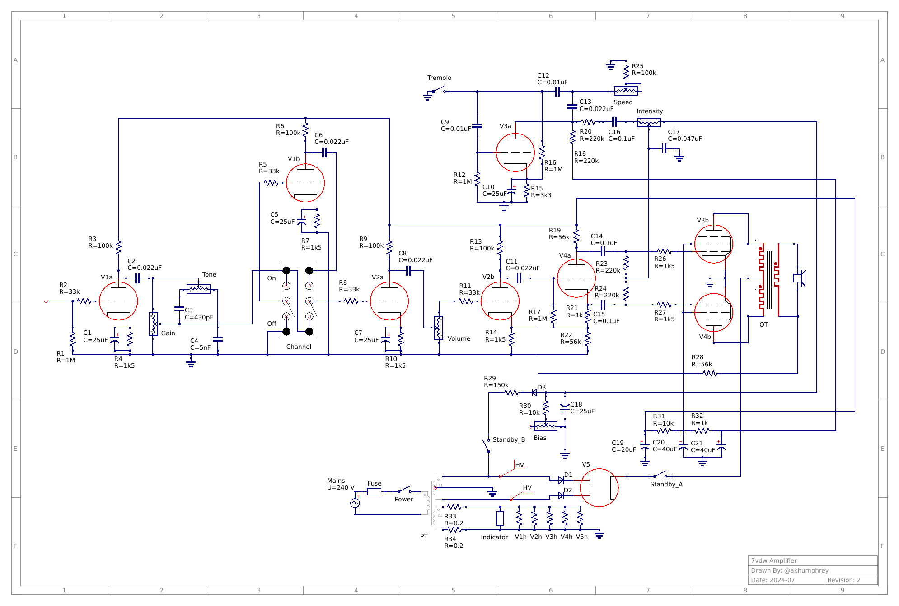

# 7vdw Amplifier

This directory contains the source files for the 7vdw tube amplifier as I go through the process of designing and building the prototype.

## Background

## Provided files

### Common
- [bom.csv](bom.csv) - a simple Bill of Materials for the major components (excludes wiring, transformers, and off-board hardware).
- [schematic/main.sch](schematic/main.sch) - the schematic, in [Qucs-S](https://ra3xdh.github.io/) format.
- [schematic/main.png](schematic/main.png) - an image render of the schematic, as seen at the top of this section.
- [schematic/tubes.lib](schematic/tubes.lib) - a Qucs-S library which contains custom schematic symbols for the vacuum tubes in my designs.

## Design goals

### Power

### Preamp

The overall design of the preamp is my best guess at cloning the classic 60s era [Fender Princeton (6G2)](https://en.wikipedia.org/wiki/Fender_Princeton).

### Summary

What I'm left with is an untested prototype circuit which should **not** be considered safe/accurate/working/usable in any capacity.
