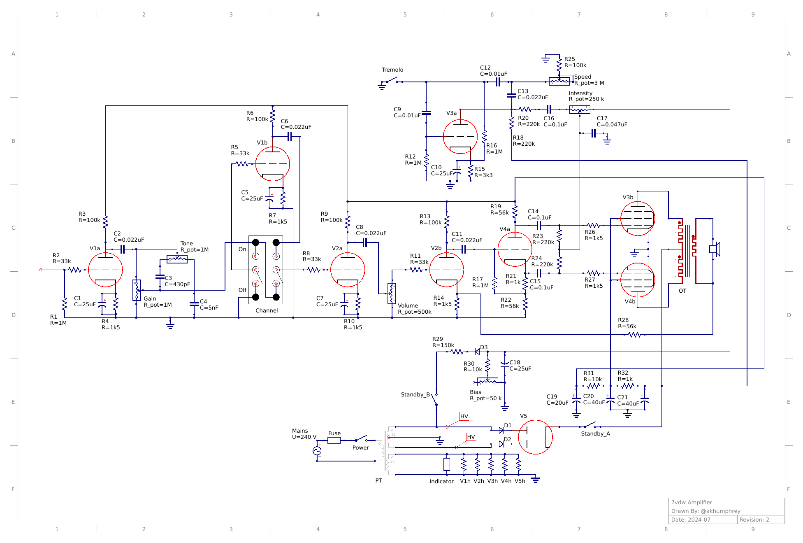

# 7vdw Amplifier

This directory contains the source files for the 7vdw tube amplifier as I go through the process of designing and building the prototype.

## Background

The origins of this amplifier begin with a [Columbus model 7VDW](https://www.vintageradio.co.nz/model/columbus/7vdw). After _somehow_ succeeding in building a working guitar amp out of the remnants of a [Philco 1224 radio](../1224), I bought this non-functioning unit with the explicit goal of making another amp.

## Design goals
I have a few main goals with this build:
- Ideally, the amp should be push-pull instead of single-ended;
- I want to use the ECL82 tubes from the original radio, because the idea of a combined triode/beam tetrode in one housing is so fascinating;
- I really want the amp to have a tremolo, because I don't have that effect in my arsenal right now.

The original 7VDW unit was designed for stereo, so it runs two single-ended output transformers (in ultra-linear mode). Only one of these original output transfomers still works, so I'll save that for something else in the future. In the meantime, I have ordered a [Hammond 1750Z](https://www.hammfg.com/part/1750Z) push-pull output transformer. It's a little oversized for the job, but I'd rather have more capacity than I need.

I looked through a few simple push-pull amplifier circuit designs, and settled on basing this design around another old Fender Princeton, in this case an early 60s 6G2 "Brownface".

### Power
The original power transformer has survived and is working fine. Based on some simple math of the current draw which the original radio unit drew, it should be more than capable to provide the necessary current to service this amp design.

I have incorporated the same UF4007 "rectifier backup" diodes from my previous design, because they cost almost nothing and hopefully add a little protection against the very-old rectifier tube kicking the bucket in dramatic fashion.

Additionally, due to the size limits on the filter capacitor following the EZ81 rectifier, I have kept the same 40uF/40uF/20uF filtering arrangement from the original radio design, instead of the more traditional 30uF/30uF/30uF used with the 5Y3 rectifier in the real Princeton.

Lastly, I have replaced the 30k resistor in the negative bias circuit with a 10k resistor and a 50k multi-turn trimpot. The hope here is that I can use the trimpot to dial in the negative bias more accurately, instead of resistor-swapping until its right.

## Provided files

### Layouts
The layout files were created with [DIY Layout Creator](https://github.com/bancika/diy-layout-creator). The layouts include:
- the turret/eyelet boards themselves
- all componets
- all off-board and underside wiring
- all hardware
- and wiring for both transformers.

I've tried to keep the wires from obscuring the board as much as possible, and to keep the crossing of wires to a minimum. Obviously this became somewhat less successful at the ECL82 tubes!
All topside wiring is rendered using solid lines, where underside wiring is indicated using _dashed_ lines. Additionally, any eyelet/turret junction which sees significant voltage (30+V) has been rendered in **red**, usually because one of the B+ lines runs through the joint.

- [layouts/main.diy](layouts/main.diy) - the main chassis layout, in DIYLC format.
- [layouts/main.pdf](layouts/main.pdf) - a vector PDF render of the main turret chassis layout, exported from DIYLC.
- [layouts/main.png](layouts/main.png) - a raster image render of the main turret layout, as seen at the top of this README.

### Schematic
The schematic has been provided in [Qucs-S](https://ra3xdh.github.io/) format, but **no effort** has been taken to make the circuit suitable for using with any of the SPICE derivatives.

- [schematic/main.sch](schematic/main.sch) - the schematic itself.
- [schematic/main.png](schematic/main.png) - an image render of the schematic, as seen at the top of this section.
- [schematic/tubes.lib](schematic/tubes.lib) - a Qucs-S library which contains custom schematic symbols for the vacuum tubes in my designs.

### Misc
- [bom.csv](bom.csv) - a simple Bill of Materials for the major components. Excludes wiring, transformers, and off-board hardware.

## Summary

What I'm left with is an untested prototype circuit which should **not** be considered safe/accurate/working/usable in any capacity.
