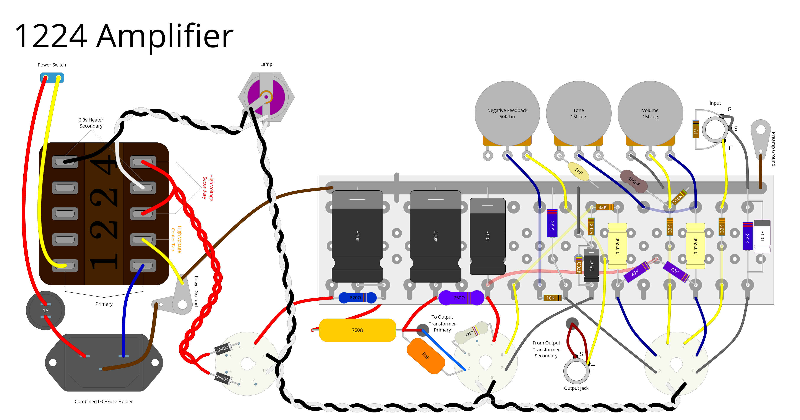
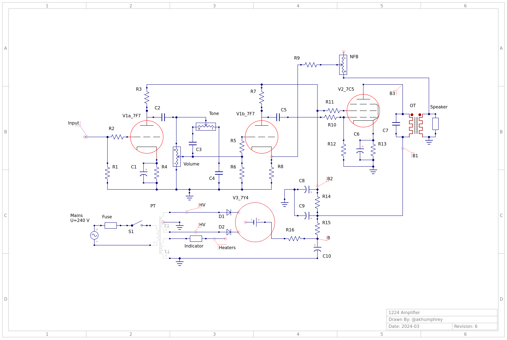

# 1224 Amplifier

This repository contains the source files for a tube amplifier as I go through the process of designing and building the prototype.

## Background

The origins of this amplifier begin with a [Philco model 1224](https://www.vintageradio.co.nz/model/philco/1224). I originally picked up a non-functioning unit with the intent of restoring it to a working state, but it very quickly became apparent that this wouldn't be possible. I did manage to salvage a working power transformer, output transformer and speaker from the otherwise useless components and chassis.

After tracking down a [schematic of the original radio](https://www.vintageradio.co.nz/static/images/models/philco/1224/Philco_1224_schematic.png), the new plan became to try and build a guitar amplifier instead.

I am a complete novice at this electronics thing, so this repository also serves as a record of my progress in learning and (hopefully!) understanding.

## Provided files

### Common
- [bom.csv](bom.csv) - a simple Bill of Materials for the major components (excludes wiring, transformers, and off-board hardware).
- [schematic/main.sch](schematic/main.sch) - the schematic, in [Qucs-S](https://ra3xdh.github.io/) format.
- [schematic/main.png](schematic/main.png) - an image render of the schematic, as seen at the top of this section.
- [schematic/tubes.lib](schematic/tubes.lib) - a Qucs-S library which contains custom schematic symbols for the 7C5, 7F7 and 7Y4 tubes.

### Eyelet Board
- [layouts/eyelet/main.diy](layouts/eyelet/main.diy) - the main chassis layout in [DIY Layout Creator](https://github.com/bancika/diy-layout-creator) format. This layout includes the eyelet board itself, all components, all off-board wiring, all hardware and wiring for both transformers. The eyelet colours indicate their purpose:
  - blue - standard eyelets, every component or wire which arrives at these junctions are electrically connected.
  - red - similar to blue eyelets, red eyelets just indicate the B+ voltage test points. These same points correlate with the labelled B+ test points also given in the [schematic](schematic.sch).
  - white - these eyelets act as holes for wiring to pass through to the underside of the eyelet board **without making an electrical connection to the eyelet**. The intent is to keep the eyelet board free from fly wires running over the top of components, whilst keeping the wiring as tidy as possible.
- [layouts/eyelet/main.pdf](layouts/eyelet/main.pdf) - a vector PDF render of the main eyelet chassis layout, exported from DIY Layout Creator.
- [layouts/eyelet/main.png](layouts/eyelet/main.png) - an image render of the main eyelet layout.
- [layouts/eyelet/underside.diy](layouts/eyelet/underside.diy) - this is an isolated layout of just the eyelet board, **shown from the underside**. This layout _only_ includes the eyelet board (which has been flipped horizontally), all underside jumper wires (or wires which have passed through from above the eyelet board), and the large off-board 750&#8486; resistor (because it connects to the underside of the board). All other components, off-board wiring, transformers and hardware are excluded for clarity. The eyelet colours (and their meanings) from [layouts/eyelet/main.pdf](layouts/eyelet/main.pdf) have been retained.
- [layouts/eyelet/underside.pdf](layouts/eyelet/underside.pdf) - a vector PDF render of the isolated underside eyelet board layout, exported from DIY Layout Creator.

### Turret Board
- [layouts/turret/main.diy](layouts/turret/main.diy) - the main chassis layout in [DIY Layout Creator](https://github.com/bancika/diy-layout-creator) format. This layout includes the turret board itself, all components, all off-board wiring, all hardware and wiring for both transformers. The turret colours indicate their purpose:
  - blue - standard turrets, every component or wire which arrives at these junctions are electrically connected.
  - white - these turrets act as holes for wiring to pass through to the underside of the turret board **without making an electrical connection to the turret**. The intent is to keep the turret board free from fly wires running over the top of components, whilst keeping the wiring as tidy as possible.
- [layouts/turret/main.pdf](layouts/turret/main.pdf) - a vector PDF render of the main turret chassis layout, exported from DIY Layout Creator.
- [layouts/turret/main.png](layouts/turret/main.png) - an image render of the main turret layout, as seen at the top of this README.

## Design goals

### Power

In my lack of experience, I've used as much as possible from existing schematics. The power supply, rectification, filtering and output stages have been lifted from the original schematic and modified as necessary. Key changes include:

- replaced the three capacitor can with individual capacitors of the same value and rating - a cost-saving measure;
- replaced the 1500 Ω, centre-tapped power resistor with two 750 Ω resistors (of appropriate power dissipation) in series - another cost-saving measure;
- replaced the 100 Ω, 1 Watt voltage dropping resistor (R15) with an 820 Ω, 3 Watt resistor - the original design was clearly intended for a lower mains voltage than is present today, so this was necessary to bring the much higher B+ back down to reasonable levels;
- added two UF4007 diodes between the high voltage secondary winding and the rectifier tube - an effort in catastrophe protection in case the rectifier fails.

A further minor deviation from the original design is to separate the grounding of the filter capacitors. In the original schematic, the three capacitor can is grounded, but it isn't clear exactly where the component is actually grounded within the chassis.

I have opted to ground the first filter capacitor separately, as close as possible to the power transformer's high voltage secondary center tap. The remaining filter capacitors have been attached to the preamp's ground rail, which eventually gets grounded at a chassis lug near the input jack.

### Preamp

The overall design of the preamp is my best guess at cloning the classic tweed era [Fender Princeton (5F2-A)](https://en.wikipedia.org/wiki/Fender_Princeton). Instead of the usual 12AX7 for the cascading gain stages, they are instead provided by a similar-in-performance 7F7 dual triode tube. The μ of the 7F7 is only `70` (as opposed to the `100` of a 12AX7), but that will almost certainly have so little difference on the final product as to be negligible.

In a similar vein, the output tube is a 7C5 power pentode - the loctal equivalent of the 6V6GT you would normally see in a Princeton of this era.

### Summary

What I'm left with is an untested prototype circuit which should **not** be considered safe/accurate/working/usable in any capacity.

## Future Goals

I have calculated that the speaker impedance expected by the output transfomer is a rather non-standard value, somewhere between 2.6 and 3 Ω. There doesn't appear to be any manufacturer who currently produces a speaker with this impedance, so I'm left with two options:
- stick with the vintage speaker I have, no matter how good or bad it sounds; or
- replace the output transformer with something which can handle a more conventional speaker load.

If I manage to actually build something usable, I'd like to keep using the vintage speaker. This is of course dependent on whether that speaker sounds any good at all, too. My suspicion (based on tests so far) is that it has a really unique (and musical!) character, so barring any catastrophes it should be absolutely usable.

## References

I took a lot of learning and guidance from other "similar" schematics and the teaching of much more learned individuals while coming up with this design. I stand upon the shoulders of giants, and they are mentioned here in no particular order:

### General

- [https://el34world.com/charts/grounds.htm](https://el34world.com/charts/grounds.htm)
- [https://www.ampbooks.com/mobile/amplifier-calculators/cathode-capacitor/calculator/](https://www.ampbooks.com/mobile/amplifier-calculators/cathode-capacitor/calculator/)
- [https://www.youtube.com/playlist?list=PLhk_5-kIFMR6hYTqkiCGOVxa3RP3x8FsA](https://www.youtube.com/playlist?list=PLhk_5-kIFMR6hYTqkiCGOVxa3RP3x8FsA)
- [https://www.analogethos.com/blog/search/tube%20amplifier](https://www.analogethos.com/blog/search/tube%20amplifier)
- [https://northcoastsynthesis.com/news/how-to-choose-component-values/](https://northcoastsynthesis.com/news/how-to-choose-component-values/)
- [https://www.valvewizard.co.uk/localfeedback.html](https://www.valvewizard.co.uk/localfeedback.html)
- [https://el34world.com/charts/currentflow.htm](https://el34world.com/charts/currentflow.htm)

### Load Lines

- [https://robrobinette.com/Drawing_Tube_Load_Lines.htm](https://robrobinette.com/Drawing_Tube_Load_Lines.htm)
- [https://www.analogethos.com/post/load-lines](https://www.analogethos.com/post/load-lines)

### Biasing

- [https://robrobinette.com/How_to_Bias_a_Tube_Amp.htm](https://robrobinette.com/How_to_Bias_a_Tube_Amp.htm)
- [https://www.youtube.com/watch?v=L3rRk3eSTnA](https://www.youtube.com/watch?v=L3rRk3eSTnA)
- [https://www.youtube.com/watch?v=ucG3s863x1c](https://www.youtube.com/watch?v=ucG3s863x1c)
- [https://guitarscience.net/tsc/info.htm](https://guitarscience.net/tsc/info.htm)
- [https://www.youtube.com/watch?v=BatwDYFJ9ug](https://www.youtube.com/watch?v=BatwDYFJ9ug)
- [https://www.ampbooks.com/mobile/classic-circuits/bassman-tonestack/](https://www.ampbooks.com/mobile/classic-circuits/bassman-tonestack/)
- [https://robrobinette.com/How_The_TMB_Tone_Stack_Works.htm](https://robrobinette.com/How_The_TMB_Tone_Stack_Works.htm)
